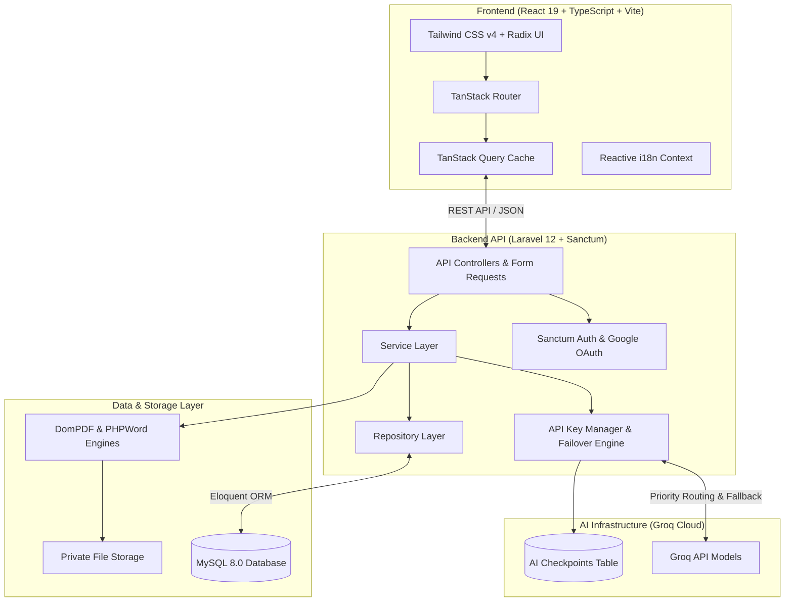

<div align="center">

# 📄 ResumeNova

**The Next-Generation AI-Powered Career Platform & Intelligent Resume Builder**

An enterprise-grade, self-hosted web platform that combines multi-model AI content generation, dual-layer ATS resume matching, interview simulation, and multi-key failover infrastructure.

[](https://www.php.net/)
[](https://laravel.com/)
[](https://react.dev/)
[](https://www.typescriptlang.org/)
[](https://tailwindcss.com/)
[](https://pestphp.com/)
[](backend/composer.json)

[Key Features](#-key-features) • [Architecture](#-system-architecture) • [Tech Stack](#-technology-stack) • [Quick Start](#-quick-start) • [Environment](#-environment-configuration) • [Documentation](#-documentation-ecosystem)

---

</div>

## 📌 Why ResumeNova?

Modern job seekers face two primary obstacles: **opaque Applicant Tracking Systems (ATS)** that filter out qualified candidates and **rate-limited AI tools** that produce generic, hallucinated buzzwords.

**ResumeNova** solves this by offering a unified, privacy-focused platform with:

- **Zero-Drop AI Reliability**: Multi-key priority routing with automatic rate-limit cooldown auto-recovery and mid-generation state checkpointing.
- **Dual-Layer ATS Intelligence**: Deterministic structural validation combined with deep semantic matching against real job descriptions.
- **Complete Career Lifecycle**: From resume branching and version history to tailored cover letters, interactive mock interviews, and multi-format document exports (PDF & DOCX).
- **Self-Hosted Privacy**: Full ownership of user data, prompt templates, and database records with AES-256 encrypted credential storage.

---

## ✨ Key Features

### 1. 🤖 AI-Powered Resume Builder

- **Dynamic Content Generation**: Generate high-impact summaries, quantifiable work experience bullet points, project descriptions, and tailored skill lists in seconds.
- **Version Branching & Rollback**: Create targeted resume variants for different job roles with non-destructive version history and one-click restoration.
- **Multiple Layout Templates**: Switch between recruiter-tested templates (Modern, Corporate, ATS Clean, Creative) with dynamic live previews.

### 2. 🎯 Dual-Layer ATS Analyzer

- **Layer 1 (Deterministic)**: Checks keyword density, formatting compliance, structural section completeness, and contact information.
- **Layer 2 (Semantic AI)**: Analyzes skill alignment, experience relevance, and role matching against target job descriptions with actionable improvement suggestions.
- **Historical Tracking**: Monitor ATS score trends across resume versions over time.

### 3. ✉️ Context-Aware Cover Letters

- **Job-Specific Personalization**: Automatically reads your resume profile and the target job description to produce tailored, persuasive cover letters.
- **Multilingual Drafting**: Generate professional letters tailored for international markets.

### 4. 🎙️ Interactive Mock Interview Prep

- **Structured Question Generation**: Curates role- and seniority-specific Technical, HR, Behavioral, and Situational questions.
- **AI Answer Evaluation**: Submit answers to receive immediate scoring, strength assessments, and model answer suggestions.

### 5. ⚡ Multi-Key AI Failover Infrastructure

- **BYOK (Bring Your Own Key)**: Add multiple personal Groq API keys with custom priority ordering.
- **Automatic Failover**: When a key encounters a `429 Too Many Requests` or quota limitation, the system automatically transitions to the next active key.
- **Rate-Limit Cooldown Auto-Recovery**: Keys in cooldown automatically reactivate once their rate-limit window expires.
- **Checkpoint Continuation**: Saves mid-generation progress so long AI responses resume seamlessly without re-running.

### 6. 📄 Professional Document Exports

- **Pixel-Perfect PDF**: Render crisp, standard-compliant PDF documents using optimized HTML-to-PDF pipelines.
- **Editable DOCX**: Generate native Microsoft Word (`.docx`) files with structured styles and typography.
- **Secure File Delivery**: Download exports securely with user-scoped access control.

### 7. 🛡️ Enterprise Administration & Auditability

- **Role-Based Access Control (RBAC)**: Distinct permissions for `super_admin`, `admin`, and `user`.
- **System & Security Logs**: Comprehensive audit trails recording user logins, role changes, resume actions, and API events.
- **Analytics Dashboard**: Real-time tracking of platform usage, active resumes, export counts, and API health.

### 8. 🌐 Reactive Internationalization (i18n)

- **Instant Dual-Language UI**: Switch seamlessly between **English (`EN`)** and **Bengali (`বাং` / `BN`)** across sidebars, dashboards, settings, and navigation without page refresh.

---

## 🏗️ System Architecture



---

## 💻 Technology Stack

| Layer                   | Technologies                                       | Description                                              |
| :---------------------- | :------------------------------------------------- | :------------------------------------------------------- |
| **Frontend SPA**        | React 19, TypeScript 5.8, Vite 6                   | High-performance single-page application                 |
| **Routing & State**     | TanStack Router, TanStack Query v5                 | Type-safe client-side routing and optimistic caching     |
| **Styling & UI**        | Tailwind CSS v4, Radix UI Primitives, Lucide Icons | Responsive modern design system with Dark/Light modes    |
| **Backend Framework**   | Laravel 12, PHP 8.3+                               | Robust RESTful service architecture                      |
| **Authentication**      | Laravel Sanctum, Laravel Socialite                 | Token-based API auth and Google OAuth integration        |
| **AI Inference**        | Groq API (Qwen, DeepSeek Distill, Llama Models)    | High-speed LLM inference with failover management        |
| **Database**            | MySQL 8.0+                                         | Relational schema with 25 structured migrations          |
| **Document Generation** | `barryvdh/laravel-dompdf`, `phpoffice/phpword`     | Programmatic PDF and Microsoft Word document compilation |
| **Testing & Quality**   | PestPHP 4, PHPUnit, ESLint 9, Prettier             | Automated test coverage and strict linting               |

---

## 🚀 Quick Start

### Prerequisites

Ensure you have the following installed locally:

- **PHP** >= 8.3
- **Composer** >= 2.6
- **Node.js** >= 20.x and **npm**
- **MySQL** >= 8.0

---

### Installation Steps

#### 1. Clone the Repository

```bash
git clone https://github.com/Aqib2607/ResumeNova.git
cd ResumeNova
```

#### 2. Backend Setup

```bash
# Navigate to backend directory
cd backend

# Install PHP dependencies
composer install

# Copy environment configuration
cp .env.example .env

# Generate application key
php artisan key:generate
```

#### 3. Database Configuration

Create a MySQL database for the application:

```sql
CREATE DATABASE IF NOT EXISTS resumenova CHARACTER SET utf8mb4 COLLATE utf8mb4_unicode_ci;
```

Update your `backend/.env` file:

```env
DB_CONNECTION=mysql
DB_HOST=127.0.0.1
DB_PORT=3306
DB_DATABASE=resumenova
DB_USERNAME=root
DB_PASSWORD=your_password
```

Run migrations and database seeders:

```bash
php artisan migrate --seed
```

#### 4. Frontend Setup

In the project root directory:

```bash
# Navigate back to project root
cd ..

# Install frontend dependencies
npm install
```

---

### Running the Application Locally

You can run the backend and frontend concurrently:

**Terminal 1 (Backend API & Queue):**

```bash
cd backend
php artisan serve --port=8000
```

**Terminal 2 (Frontend Development Server):**

```bash
npm run dev
```

Visit **`http://localhost:5173`** (or **`http://127.0.0.1:8000`**) in your browser.

---

## ⚙️ Environment Configuration

### Key Environment Variables (`backend/.env`)

```env
APP_NAME=ResumeNova
APP_ENV=local
APP_KEY=base64:...
APP_DEBUG=true
APP_URL=http://localhost:8000
FRONTEND_URL=http://localhost:5173

# Database
DB_CONNECTION=mysql
DB_HOST=127.0.0.1
DB_PORT=3306
DB_DATABASE=resumenova
DB_USERNAME=root
DB_PASSWORD=

# Cache & Queues
CACHE_STORE=database
QUEUE_CONNECTION=database
SESSION_DRIVER=database

# AI Engine (Groq Default System Key)
GROQ_API_KEY=gsk_your_groq_api_key
GROQ_VERIFY_SSL=true

# Google OAuth (Optional)
GOOGLE_CLIENT_ID=your-client-id.apps.googleusercontent.com
GOOGLE_CLIENT_SECRET=your-client-secret
GOOGLE_REDIRECT_URI=http://localhost:8000/api/auth/google/callback

# Sanctum Stateful Domains
SANCTUM_STATEFUL_DOMAINS=localhost:5173,127.0.0.1:5173,localhost:8000,127.0.0.1:8000
```

---

## 🧪 Testing & Verification

The codebase includes an automated test suite and code quality checks.

```bash
# Run backend Pest test suite (111 tests / 384 assertions)
cd backend
php artisan test

# Run frontend ESLint code verification
npm run lint

# Run code formatting check
npm run format

# Run frontend TypeScript validation & production build
npm run build
```

---

## 📂 Project Structure

```text
ResumeNova/
├── backend/                       # Laravel 12 REST API backend
│   ├── app/
│   │   ├── Http/Controllers/     # API & Admin Controllers
│   │   ├── Models/               # Eloquent Models (User, Resume, ApiKey, etc.)
│   │   ├── Repositories/         # Repository Data-Access Layer
│   │   ├── Services/             # Business Logic & AI Engines
│   │   └── Services/AI/          # Groq Provider & Failover Engine
│   ├── config/                   # Application & AI Configurations
│   ├── database/
│   │   ├── migrations/           # 25 Database Schema Migrations
│   │   └── seeders/              # Initial Database Seeders
│   ├── routes/
│   │   ├── api.php               # Protected REST API Routes
│   │   └── web.php               # Web & Asset Delivery Routes
│   └── tests/                    # PestPHP Test Suite (111 Feature Tests)
│
├── src/                          # React 19 SPA Frontend
│   ├── components/               # UI Primitives, Brand & Layouts
│   │   ├── layouts/              # AppSidebar, Topbar, AuthLayout
│   │   └── ui/                   # Radix UI & Tailwind Components
│   ├── context/                  # i18n & Theme Context Providers
│   ├── hooks/                    # Custom Hooks (useDashboard, useAI, useAuth)
│   ├── routes/                   # TanStack Router File-Based Pages
│   │   ├── admin.*.tsx           # Admin Portal Routes
│   │   ├── dashboard.*.tsx       # User Dashboard & Feature Routes
│   │   └── index.tsx             # Public Landing Page
│   └── services/                 # API Client & Axios Endpoints
│
├── docs/                         # Comprehensive Engineering Documentation
└── package.json                  # Root Frontend Manifest & Scripts
```

---

## 📚 Documentation Ecosystem

For detailed technical specifications, runbooks, and architectural diagrams, refer to the documentation in [`docs/`](docs/):

| Category         | Document                                                                     | Description                                           |
| :--------------- | :--------------------------------------------------------------------------- | :---------------------------------------------------- |
| **Architecture** | [`Requirements Architecture`](docs/01_Requirements_Architecture_Document.md) | High-level system requirements and design             |
| **Architecture** | [`Functional Specification`](docs/02_Functional_Specification_Document.md)   | Detailed functional behavior specifications           |
| **Database**     | [`Database Architecture`](docs/03_Database_Architecture_Document.md)         | Entity relationships, indexes, and schema definitions |
| **Product**      | [`PRD (Product Requirements)`](docs/04_PRD_Product_Requirements_Document.md) | Product vision, scope, and feature matrix             |
| **Design**       | [`Design Document`](docs/05_Design_Document.md)                              | UI/UX guidelines and component systems                |
| **Tech Stack**   | [`Tech Stack Document`](docs/06_Tech_Stack_Document.md)                      | Complete technology choices and rationales            |
| **Operations**   | [`Production Deployment Guide`](docs/PRODUCTION_DEPLOYMENT_GUIDE.md)         | Server setup, Nginx, Supervisor, and SSL runbook      |
| **Operations**   | [`Environment Reference`](docs/PRODUCTION_ENVIRONMENT_REFERENCE.md)          | Production variable specifications and requirements   |
| **Runbooks**     | [`Backup & Restore Runbook`](docs/BACKUP_AND_RESTORE_RUNBOOK.md)             | Database dump, snapshot, and recovery procedures      |
| **Runbooks**     | [`Rollback Runbook`](docs/ROLLBACK_RUNBOOK.md)                               | Safe rollback procedures for releases                 |
| **Runbooks**     | [`Monitoring Runbook`](docs/PRODUCTION_MONITORING_RUNBOOK.md)                | System health, error logs, and queue metrics          |
| **Runbooks**     | [`Incident Response Runbook`](docs/INCIDENT_RESPONSE_RUNBOOK.md)             | Triage and severity classification guide              |
| **Audit**        | [`Complete Audit Report`](docs/ResumeNova_Complete_Audit_Report.md)          | Quality, security, and stability audit report         |
| **Audit**        | [`Production Readiness Audit`](docs/FINAL_PRODUCTION_READINESS_AUDIT.md)     | Final pre-launch validation and verification          |

---

## 🔒 Security & Privacy

- **Encrypted API Keys**: User-provided Groq API keys are encrypted at rest using `AES-256-CBC` before being stored in the database.
- **Backend-Only Inference**: Client browsers never communicate directly with external AI endpoints; all requests are authenticated and brokered through the Laravel backend.
- **Scoped Authorization**: Role-based access control (RBAC) and policy-driven ownership checks ensure users can only access their own documents, analyses, and credentials.
- **Input Sanitization & Rate Limiting**: Built-in throttle middleware prevents brute-force attempts on authentication and AI routes.

---

## 🤝 Contributing

Contributions to ResumeNova are welcome! To contribute:

1. **Fork the Repository** on GitHub.
2. **Create a Feature Branch**: `git checkout -b feature/your-feature-name`.
3. **Commit Your Changes**: `git commit -m "feat: add your feature description"`.
4. **Ensure All Tests Pass**: Run `php artisan test` and `npm run lint`.
5. **Push to Your Branch**: `git push origin feature/your-feature-name`.
6. **Open a Pull Request** explaining your changes.

---

## 📄 License

This project is open-sourced under the [MIT License](backend/composer.json).

---

## 💬 Support & Issues

If you encounter any issues, have feature suggestions, or need help:

- Open an issue on the [GitHub Issues](https://github.com/Aqib2607/ResumeNova/issues) tracker.
- Review existing runbooks in the [`docs/`](docs/) directory.

---

<div align="center">
  <sub>Built with precision using Laravel 12, React 19, TypeScript, and Groq AI.</sub>
</div>
