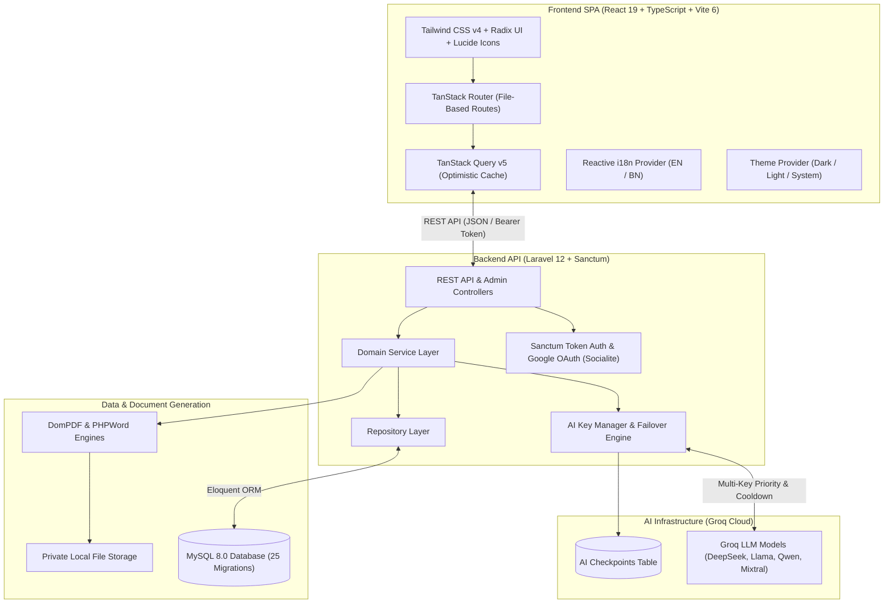

<div align="center">

# 📄 ResumeNova

**The Next-Generation AI-Powered Career Platform & Intelligent Resume Builder**

An enterprise-grade, self-hosted web platform that combines multi-model AI content generation, dual-layer ATS resume matching, interview simulation, multi-format document exports, and resilient multi-key failover infrastructure.

[](https://www.php.net/)
[](https://laravel.com/)
[](https://react.dev/)
[](https://www.typescriptlang.org/)
[](https://vitejs.dev/)
[](https://tailwindcss.com/)
[](https://pestphp.com/)
[](#license)

[Why ResumeNova](#why-resumenova) • [Key Features](#key-features) • [System Architecture](#system-architecture) • [Technology Stack](#technology-stack) • [Quick Start](#quick-start) • [Environment Config](#environment-configuration) • [API Reference](#api-reference) • [Testing](#testing--verification) • [Docs Ecosystem](#documentation-ecosystem) • [Security](#security--privacy)

---

</div>

## <a id="why-resumenova"></a>📌 Why ResumeNova?

Job seekers and career professionals encounter two major obstacles in modern hiring: **opaque Applicant Tracking Systems (ATS)** that discard qualified candidates over formatting nuances, and **unreliable, rate-limited AI tools** that generate generic buzzwords or fail mid-stream.

**ResumeNova** delivers a unified, privacy-focused career platform engineered for reliability and intelligence:

- 🛡️ **Zero-Drop AI Reliability**: Multi-key priority routing with automatic `429 Too Many Requests` failover, exponential rate-limit cooldown auto-recovery, and mid-generation state checkpointing.
- 🎯 **Dual-Layer ATS Intelligence**: Combines deterministic structural rule checking with deep semantic AI gap analysis against specific job descriptions.
- 🔄 **Non-Destructive Version History**: Instant snapshot branching, version comparison, and one-click rollback for targeting different roles.
- 💼 **Full Career Lifecycle Suite**: AI-powered resume builder, context-aware cover letters, interactive mock interview simulation with scoring & feedback, and multi-format document exports (PDF & DOCX).
- 🌐 **Reactive Internationalization (i18n)**: Seamless instant switching between **English (`EN`)** and **Bengali (`বাং` / `BN`)** without page reloads.
- 🔒 **Self-Hosted Privacy**: Full control over database records, user prompts, and AES-256 encrypted API credentials.

---

## <a id="key-features"></a>✨ Key Features

### 1. 🤖 AI-Powered Resume Builder

- **Dynamic Content Generation**: Generate high-impact professional summaries, quantifiable work experience bullet points, project descriptions, and tailored skill recommendations powered by Groq LLMs.
- **Version Branching & 1-Click Rollback**: Create customized variants for each job role, retain historical snapshots, and restore any previous version instantly.
- **Recruiter-Tested Templates**: Switch dynamically between modern, corporate, minimalist, ATS clean, and creative layouts with live responsive preview.

### 2. 🎯 Dual-Layer ATS Analyzer

- **Layer 1 (Deterministic Engine)**: Evaluates section completeness, formatting compliance, contact details, and core keyword density.
- **Layer 2 (Semantic Groq AI)**: Analyzes skill alignment, experience relevance, and role matching against target job descriptions with actionable score breakdowns and improvement roadmaps.
- **Historical Score Tracking**: Monitor ATS match score improvements over time.

### 3. ✉️ Context-Aware Cover Letters

- **Job-Specific Personalization**: Analyzes user resume profile and target job descriptions to draft customized, persuasive cover letters.
- **Tone & Language Controls**: Choose tone profiles (Professional, Confident, Conversational) and generate multi-language drafts.
- **Instant Export**: Export directly to PDF or editable Microsoft Word (`.docx`).

### 4. 🎙️ Interactive Mock Interview Prep

- **Tailored Question Generation**: Generates role- and seniority-specific Technical, HR, Behavioral, and Situational questions.
- **AI Answer Evaluation**: Submit text answers to receive instant scoring (1-100), strength assessments, constructive critique, and model answer recommendations.
- **Session History**: Track past interview sessions and performance analytics.

### 5. ⚡ Multi-Key AI Failover Infrastructure

- **BYOK (Bring Your Own Key)**: Add multiple personal Groq API keys with custom priority rankings.
- **Automatic Failover**: Seamlessly shifts to subsequent keys upon encountering rate limits (`429`) or quota exhaustion.
- **Cooldown Auto-Recovery**: Keys in cooldown automatically reactivate once the rate-limit window resets.
- **Live Key Verification**: Instant connection testing directly from the dashboard settings.
- **Checkpoint Continuation**: Saves mid-generation state in `ai_checkpoints` to resume long generations without token waste.

### 6. 📄 Multi-Format Document Exports

- **Pixel-Perfect PDF**: Render standardized, crisp PDF documents using optimized DomPDF rendering engines.
- **Editable Microsoft Word (`.docx`)**: Generate native `.docx` files using PHPWord with structured styles and typography.
- **Polymorphic Export Logging**: User-scoped download links, export history tracking, and secure asset delivery.

### 7. 🛡️ Enterprise Administration & Auditability

- **Role-Based Access Control (RBAC)**: Distinct permissions for `super_admin`, `admin`, and `user`.
- **User & Template Management**: Admin user role assignment, user suspension/reactivation, and resume template toggles.
- **System & Security Logs**: Comprehensive audit trails recording user logins, role changes, resume actions, and system error events.
- **Analytics Dashboard**: Real-time platform usage charts, resume creation trends, export metrics, and API health monitoring.

### 8. 🌐 Reactive Internationalization (i18n) & Theme

- **Dual-Language UI**: Instant reactive switching between English and Bengali across all dashboard widgets, navigation, and auth pages.
- **Adaptive Dark / Light / System Theme**: Polished theme support with smooth transitions.

---

## <a id="system-architecture"></a>🏗️ System Architecture



---

## <a id="technology-stack"></a>💻 Technology Stack

| Layer                   | Technologies                                                | Description                                              |
| :---------------------- | :---------------------------------------------------------- | :------------------------------------------------------- |
| **Frontend Framework**  | React 19.x, TypeScript 5.8, Vite 6.0                        | High-performance, modern single-page application         |
| **Routing & State**     | TanStack Router 1.170, TanStack Query v5                    | Type-safe client-side routing and optimistic caching     |
| **Styling & UI**        | Tailwind CSS v4, Radix UI Primitives, Framer Motion, Lucide | Modern design system with Dark/Light mode and animations |
| **Form & Validation**   | React Hook Form 7.71, Zod 3.24                              | Robust form handling with schema-driven validation       |
| **Backend Framework**   | Laravel 12.x, PHP 8.3+                                      | Clean RESTful service architecture                       |
| **Authentication**      | Laravel Sanctum 4.0, Laravel Socialite 5.28                 | Token-based API auth and Google OAuth integration        |
| **AI Inference**        | Groq Cloud API (DeepSeek, Llama 3.3, Qwen 2.5, Mixtral)     | High-speed LLM inference with automated failover         |
| **Database**            | MySQL 8.0+                                                  | Relational schema with 25 structured migrations          |
| **Document Generation** | `barryvdh/laravel-dompdf` 3.1, `phpoffice/phpword` 1.1      | Programmatic PDF and Microsoft Word document compilation |
| **Testing & Quality**   | PestPHP 4.7, PHPUnit, ESLint 9, Prettier                    | Comprehensive automated test suite and strict linting    |

---

## <a id="quick-start"></a>🚀 Quick Start

### Prerequisites

Ensure you have the following installed locally:

- **PHP** >= 8.3 (with `pdo_mysql`, `mbstring`, `openssl`, `gd` or `imagick`, `zip` extensions)
- **Composer** >= 2.6
- **Node.js** >= 20.x and **npm**
- **MySQL** >= 8.0

---

### Installation Steps

#### 1. Clone the Repository

```bash
git clone https://github.com/Aqib2607/ResumeNova.git
cd ResumeNova
```

#### 2. Backend Configuration

```bash
# Navigate into backend directory
cd backend

# Install PHP dependencies
composer install

# Copy environment configuration
cp .env.example .env

# Generate application encryption key
php artisan key:generate
```

#### 3. Database Setup

Create a MySQL database for ResumeNova:

```sql
CREATE DATABASE IF NOT EXISTS resumenova CHARACTER SET utf8mb4 COLLATE utf8mb4_unicode_ci;
```

Configure your `backend/.env` file with your database credentials:

```env
DB_CONNECTION=mysql
DB_HOST=127.0.0.1
DB_PORT=3306
DB_DATABASE=resumenova
DB_USERNAME=root
DB_PASSWORD=your_password
```

Run database migrations and initial seeders:

```bash
php artisan migrate --seed
```

#### 4. Frontend Setup

From the project root directory:

```bash
# Return to project root (if inside backend/)
cd ..

# Install frontend npm dependencies
npm install
```

---

### Running the Application Locally

Start the backend API and frontend dev server:

**Terminal 1 (Backend API & Queues):**

```bash
cd backend
php artisan serve --port=8000
```

**Terminal 2 (Frontend Dev Server):**

```bash
npm run dev
```

Open your browser at **`http://localhost:5173`** (or **`http://127.0.0.1:8000`**).

---

## <a id="environment-configuration"></a>⚙️ Environment Configuration

### Key Backend Variables (`backend/.env`)

```env
# Application
APP_NAME=ResumeNova
APP_ENV=local
APP_KEY=base64:...
APP_DEBUG=true
APP_URL=http://localhost:8000
FRONTEND_URL=http://localhost:5173

# Database Connection
DB_CONNECTION=mysql
DB_HOST=127.0.0.1
DB_PORT=3306
DB_DATABASE=resumenova
DB_USERNAME=root
DB_PASSWORD=

# Session, Cache & Queue Drivers
CACHE_STORE=database
QUEUE_CONNECTION=database
SESSION_DRIVER=database

# AI Engine (Groq Default System Key)
GROQ_API_KEY=gsk_your_groq_api_key
GROQ_VERIFY_SSL=true

# Google OAuth (Optional)
GOOGLE_CLIENT_ID=your-client-id.apps.googleusercontent.com
GOOGLE_CLIENT_SECRET=your-client-secret
GOOGLE_REDIRECT_URI=http://localhost:8000/api/auth/google/callback

# Sanctum Stateful Domains
SANCTUM_STATEFUL_DOMAINS=localhost:5173,127.0.0.1:5173,localhost:8000,127.0.0.1:8000
```

---

## <a id="api-reference"></a>🔌 API Reference

### Authentication & User

| Method  | Endpoint                    | Description                              | Auth Required |
| :------ | :-------------------------- | :--------------------------------------- | :------------ |
| `POST`  | `/api/register`             | Register new account                     | No            |
| `POST`  | `/api/login`                | Login and obtain Sanctum token           | No            |
| `POST`  | `/api/logout`               | Revoke current session/token             | Yes           |
| `GET`   | `/api/auth/google`          | Redirect to Google OAuth provider        | No            |
| `GET`   | `/api/auth/google/callback` | Handle Google OAuth callback             | No            |
| `GET`   | `/api/user`                 | Fetch authenticated user profile & roles | Yes           |
| `PATCH` | `/api/profile`              | Update user profile details              | Yes           |
| `PATCH` | `/api/settings/account`     | Update account password/preferences      | Yes           |

### Dashboard & Analytics

| Method | Endpoint                        | Description                       | Auth Required |
| :----- | :------------------------------ | :-------------------------------- | :------------ |
| `GET`  | `/api/dashboard`                | Aggregated dashboard overview     | Yes           |
| `GET`  | `/api/dashboard/statistics`     | User resume and ATS score metrics | Yes           |
| `GET`  | `/api/dashboard/chart`          | Timeline chart analytics data     | Yes           |
| `GET`  | `/api/dashboard/recent-resumes` | List recently modified resumes    | Yes           |
| `GET`  | `/api/dashboard/recent-exports` | List recent document exports      | Yes           |

### Resumes & AI Generation

| Method   | Endpoint                                 | Description                          | Auth Required   |
| :------- | :--------------------------------------- | :----------------------------------- | :-------------- |
| `GET`    | `/api/resumes`                           | List user resumes                    | Yes             |
| `POST`   | `/api/resumes`                           | Create new resume                    | Yes             |
| `GET`    | `/api/resumes/{id}`                      | Get full resume payload              | Yes             |
| `PUT`    | `/api/resumes/{id}`                      | Update resume details                | Yes             |
| `DELETE` | `/api/resumes/{id}`                      | Delete resume                        | Yes             |
| `POST`   | `/api/resumes/{id}/duplicate`            | Duplicate resume variant             | Yes             |
| `GET`    | `/api/resumes/{id}/versions`             | List snapshot version history        | Yes             |
| `POST`   | `/api/resumes/{id}/versions/{v}/restore` | Restore resume to snapshot version   | Yes             |
| `POST`   | `/api/resumes/{id}/ai/summary`           | AI generate professional summary     | Yes (Throttled) |
| `POST`   | `/api/resumes/{id}/ai/experience`        | AI generate experience bullet points | Yes (Throttled) |
| `POST`   | `/api/resumes/{id}/ai/project`           | AI generate project descriptions     | Yes (Throttled) |
| `POST`   | `/api/resumes/{id}/ai/skills`            | AI extract & categorize skills       | Yes (Throttled) |

### ATS Analyzer & Cover Letters

| Method   | Endpoint                      | Description                                         | Auth Required   |
| :------- | :---------------------------- | :-------------------------------------------------- | :-------------- |
| `POST`   | `/api/ats/analyze`            | Run dual-layer ATS analysis against job description | Yes (Throttled) |
| `GET`    | `/api/ats/history`            | List historical ATS scans                           | Yes             |
| `GET`    | `/api/ats/{id}`               | Retrieve specific ATS score report                  | Yes             |
| `DELETE` | `/api/ats/{id}`               | Delete ATS analysis report                          | Yes             |
| `GET`    | `/api/cover-letters`          | List generated cover letters                        | Yes             |
| `POST`   | `/api/cover-letters/generate` | AI generate tailored cover letter                   | Yes (Throttled) |
| `GET`    | `/api/cover-letters/{id}`     | Get cover letter details                            | Yes             |
| `PUT`    | `/api/cover-letters/{id}`     | Update cover letter content                         | Yes             |
| `DELETE` | `/api/cover-letters/{id}`     | Delete cover letter                                 | Yes             |

### Mock Interview Simulator

| Method   | Endpoint                                    | Description                             | Auth Required   |
| :------- | :------------------------------------------ | :-------------------------------------- | :-------------- |
| `GET`    | `/api/interviews`                           | List past interview prep sessions       | Yes             |
| `POST`   | `/api/interviews`                           | Create new interview practice session   | Yes (Throttled) |
| `GET`    | `/api/interviews/{id}`                      | Get interview session & questions       | Yes             |
| `POST`   | `/api/interviews/{id}/questions/generate`   | Generate interview questions            | Yes (Throttled) |
| `POST`   | `/api/interviews/{id}/questions/{q}/answer` | Submit answer for AI scoring & critique | Yes (Throttled) |
| `DELETE` | `/api/interviews/{id}`                      | Delete interview session                | Yes             |

### BYOK API Keys & Document Exports

| Method   | Endpoint                          | Description                                           | Auth Required |
| :------- | :-------------------------------- | :---------------------------------------------------- | :------------ |
| `GET`    | `/api/api-keys`                   | List user Groq API keys with priority/cooldown status | Yes           |
| `POST`   | `/api/api-keys`                   | Add new encrypted API key                             | Yes           |
| `POST`   | `/api/api-keys/reorder`           | Update failover priority order                        | Yes           |
| `POST`   | `/api/api-keys/{id}/test`         | Test key validity with live Groq ping                 | Yes           |
| `DELETE` | `/api/api-keys/{id}`              | Remove API key                                        | Yes           |
| `GET`    | `/api/exports`                    | List document exports                                 | Yes           |
| `POST`   | `/api/exports/resumes/{id}`       | Trigger PDF / DOCX resume compilation                 | Yes           |
| `POST`   | `/api/exports/cover-letters/{id}` | Trigger PDF / DOCX cover letter compilation           | Yes           |
| `GET`    | `/api/exports/{id}/download`      | Download compiled binary file                         | Yes           |

### Admin Portal (`/api/admin/*`)

| Method  | Endpoint                           | Description                                       | Auth Required       |
| :------ | :--------------------------------- | :------------------------------------------------ | :------------------ |
| `GET`   | `/api/admin/dashboard`             | Global platform KPIs & metrics                    | Admin / Super Admin |
| `GET`   | `/api/admin/analytics`             | Detailed registration & export telemetry          | Admin / Super Admin |
| `GET`   | `/api/admin/users`                 | Manage user accounts & permissions                | Admin / Super Admin |
| `PATCH` | `/api/admin/users/{id}/role`       | Assign user role (`user`, `admin`, `super_admin`) | Admin / Super Admin |
| `POST`  | `/api/admin/users/{id}/suspend`    | Suspend user access                               | Admin / Super Admin |
| `POST`  | `/api/admin/users/{id}/reactivate` | Reactivate user access                            | Admin / Super Admin |
| `GET`   | `/api/admin/templates`             | Manage resume template catalogue                  | Admin / Super Admin |
| `GET`   | `/api/admin/audit-logs`            | Query security & action audit logs                | Admin / Super Admin |
| `GET`   | `/api/admin/system-logs`           | View application error & exception logs           | Admin / Super Admin |

---

## <a id="testing--verification"></a>🧪 Testing & Verification

ResumeNova includes extensive automated test coverage and strict linting pipelines.

```bash
# Run backend PestPHP feature test suite (111 tests / 384 assertions)
cd backend
php artisan test

# Run frontend ESLint code verification
npm run lint

# Run code formatting via Prettier
npm run format

# Run TypeScript compilation & production build
npm run build
```

---

## <a id="project-structure"></a>📂 Project Structure

```text
ResumeNova/
├── backend/                       # Laravel 12 REST API Backend
│   ├── app/
│   │   ├── Actions/              # Single-purpose action classes
│   │   ├── Contracts/            # Interface contracts
│   │   ├── DTOs/                 # Data transfer objects
│   │   ├── Enums/                # Backed PHP enums (Roles, Statuses)
│   │   ├── Http/Controllers/     # API, Auth & Admin Controllers
│   │   ├── Models/               # Eloquent Models (User, Resume, ApiKey, etc.)
│   │   ├── Repositories/         # Repository Data-Access Layer
│   │   ├── Services/             # Business Logic & AI Engines
│   │   └── Services/AI/          # Groq Provider & Failover Engine
│   ├── config/                   # Application & AI Configurations
│   ├── database/
│   │   ├── migrations/           # 25 Database Schema Migrations
│   │   └── seeders/              # Seeders for Users & Templates
│   ├── routes/
│   │   ├── api.php               # Protected REST API Routes
│   │   └── web.php               # Web Asset Delivery Routes
│   └── tests/                    # PestPHP Test Suite (111 Feature Tests)
│
├── src/                          # React 19 SPA Frontend
│   ├── components/               # UI Primitives, Brand & Layouts
│   │   ├── layouts/              # AppSidebar, Topbar, AuthLayout
│   │   ├── brand/                # Brand Assets & Logos
│   │   └── ui/                   # Radix UI & Tailwind Components
│   ├── context/                  # i18n (EN/BN) & Theme Context Providers
│   ├── hooks/                    # Custom Hooks (useDashboard, useAI, useAuth)
│   ├── routes/                   # TanStack Router File-Based Pages
│   │   ├── admin.*.tsx           # Admin Portal Routes (Users, Logs, Analytics)
│   │   ├── dashboard.*.tsx       # User Dashboard (Resumes, ATS, Interviews)
│   │   └── index.tsx             # Public Landing Page
│   └── services/                 # API Client & Axios Endpoints
│
├── docs/                         # Comprehensive Engineering Documentation (17 Files)
│   ├── 01_Requirements_Architecture_Document.md
│   ├── 02_Functional_Specification_Document.md
│   ├── 03_Database_Architecture_Document.md
│   ├── 04_PRD_Product_Requirements_Document.md
│   ├── 05_Design_Document.md
│   ├── 06_Tech_Stack_Document.md
│   ├── BACKUP_AND_RESTORE_RUNBOOK.md
│   ├── FINAL_DEPLOYMENT_STATE_VERIFICATION.md
│   ├── FINAL_PRODUCTION_DEPLOYMENT_REPORT.md
│   ├── FINAL_PRODUCTION_READINESS_AUDIT.md
│   ├── INCIDENT_RESPONSE_RUNBOOK.md
│   ├── PRODUCTION_DEPLOYMENT_GUIDE.md
│   ├── PRODUCTION_ENVIRONMENT_REFERENCE.md
│   ├── PRODUCTION_MONITORING_RUNBOOK.md
│   ├── PRODUCTION_SMOKE_TEST_REPORT.md
│   ├── ROLLBACK_RUNBOOK.md
│   └── ResumeNova_Complete_Audit_Report.md
│
├── dist/                         # Compiled Production Frontend Bundle
├── package.json                  # Root Frontend Manifest & Scripts
└── vite.config.ts                # Vite Configuration
```

---

## <a id="documentation-ecosystem"></a>📚 Documentation Ecosystem

For comprehensive technical specifications, deployment procedures, and operational runbooks, refer to the documentation repository in [`docs/`](docs/):

| Category         | Document                                                                     | Description                                           |
| :--------------- | :--------------------------------------------------------------------------- | :---------------------------------------------------- |
| **Architecture** | [`Requirements Architecture`](docs/01_Requirements_Architecture_Document.md) | High-level system requirements and design             |
| **Architecture** | [`Functional Specification`](docs/02_Functional_Specification_Document.md)   | Detailed functional behavior specifications           |
| **Database**     | [`Database Architecture`](docs/03_Database_Architecture_Document.md)         | Entity relationships, indexes, and schema definitions |
| **Product**      | [`PRD (Product Requirements)`](docs/04_PRD_Product_Requirements_Document.md) | Product vision, scope, and feature matrix             |
| **Design**       | [`Design Document`](docs/05_Design_Document.md)                              | UI/UX guidelines and component systems                |
| **Tech Stack**   | [`Tech Stack Document`](docs/06_Tech_Stack_Document.md)                      | Complete technology choices and rationales            |
| **Operations**   | [`Production Deployment Guide`](docs/PRODUCTION_DEPLOYMENT_GUIDE.md)         | Server setup, Nginx, Supervisor, and SSL runbook      |
| **Operations**   | [`Environment Reference`](docs/PRODUCTION_ENVIRONMENT_REFERENCE.md)          | Production variable specifications and requirements   |
| **Runbooks**     | [`Backup & Restore Runbook`](docs/BACKUP_AND_RESTORE_RUNBOOK.md)             | Database dump, snapshot, and recovery procedures      |
| **Runbooks**     | [`Rollback Runbook`](docs/ROLLBACK_RUNBOOK.md)                               | Safe rollback procedures for releases                 |
| **Runbooks**     | [`Monitoring Runbook`](docs/PRODUCTION_MONITORING_RUNBOOK.md)                | System health, error logs, and queue metrics          |
| **Runbooks**     | [`Incident Response Runbook`](docs/INCIDENT_RESPONSE_RUNBOOK.md)             | Triage and severity classification guide              |
| **Audit**        | [`Complete Audit Report`](docs/ResumeNova_Complete_Audit_Report.md)          | Quality, security, and stability audit report         |
| **Audit**        | [`Smoke Test Report`](docs/PRODUCTION_SMOKE_TEST_REPORT.md)                  | Pre-launch smoke test results and verification        |
| **Audit**        | [`Production Readiness Audit`](docs/FINAL_PRODUCTION_READINESS_AUDIT.md)     | Pre-launch validation and verification audit          |
| **Audit**        | [`Deployment Verification`](docs/FINAL_DEPLOYMENT_STATE_VERIFICATION.md)     | Deployment state verification and classification      |
| **Audit**        | [`Deployment Report`](docs/FINAL_PRODUCTION_DEPLOYMENT_REPORT.md)            | Summary deployment closure and readiness sign-off     |

---

## <a id="security--privacy"></a>🔒 Security & Privacy

- **Encrypted API Keys**: User-provided Groq API keys are encrypted at rest using `AES-256-CBC` before being stored in the database.
- **Backend-Brokered AI Inference**: Browsers never communicate directly with external AI endpoints; all requests are authenticated, authorized, and rate-throttled through the backend.
- **Scoped Authorization**: Role-based access control (RBAC) and policy-driven ownership checks ensure users can only access their own documents, analyses, and credentials.
- **Input Sanitization & Rate Limiting**: Built-in throttle middleware prevents brute-force attempts on authentication and AI routes.

---

## <a id="contributing"></a>🤝 Contributing

Contributions to ResumeNova are welcome! To contribute:

1. **Fork the Repository** on GitHub.
2. **Create a Feature Branch**: `git checkout -b feature/your-feature-name`.
3. **Commit Your Changes**: `git commit -m "feat: add your feature description"`.
4. **Ensure All Tests Pass**: Run `php artisan test` and `npm run lint`.
5. **Push to Your Branch**: `git push origin feature/your-feature-name`.
6. **Open a Pull Request** explaining your changes.

---

## <a id="license"></a>📄 License

This project is open-sourced under the [MIT License](backend/composer.json).

---

<div align="center">
  <sub>Built with precision using Laravel 12, React 19, TypeScript, and Groq AI.</sub>
</div>
